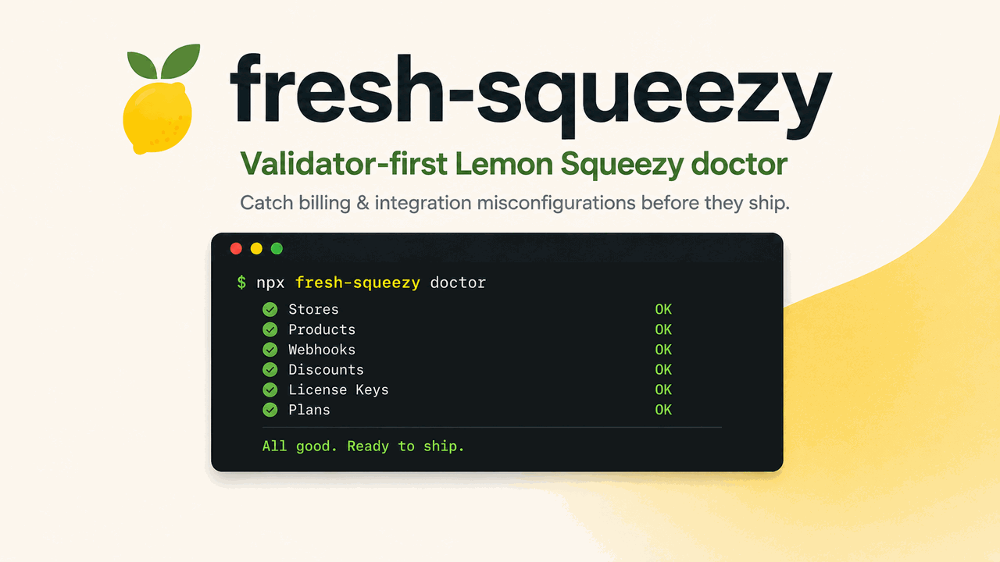

<!-- README.md からの翻訳です。英語版が正本です。 -->

<p align="center">
  <a href="https://github.com/YosefHayim/fresh-squeezy">
    
  </a>
</p>

<p align="center">
  <strong>Lemon Squeezy のセットアップを診断するドクター — 請求と Webhook の設定ミスをリリース前に検出します。</strong>
</p>

<!-- Badges. tests count is static; bump it on major test-suite changes. -->
<p align="center">
  <a href="https://www.npmjs.com/package/fresh-squeezy"></a>
  <a href="https://www.npmjs.com/package/fresh-squeezy"></a>
  <a href="https://github.com/YosefHayim/fresh-squeezy/actions/workflows/ci.yml"></a>
  <a href="./LICENSE"></a>
  
  
  <a href="https://packagephobia.com/result?p=fresh-squeezy"></a>
  
</p>

<p align="center">
  <a href="./README.md">English</a> ·
  <a href="./README.zh-CN.md">简体中文</a> ·
  <b>日本語</b> ·
  <a href="./README.es.md">Español</a> ·
  <a href="./README.pt-BR.md">Português</a>
</p>

> 翻訳は最新版に遅れる場合があります。正本は [English README](./README.md) です。

<p align="center">
  <a href="#30秒で開始">クイックスタート</a> ·
  <a href="#postman-や公式-sdk-では検出できないものを検出">検出できるもの</a> ·
  <a href="#fresh-squeezy-と代替手段の比較">比較</a> ·
  <a href="#cli">CLI</a> ·
  <a href="#ライブラリ">ライブラリ</a> ·
  <a href="#イシューコード">イシューコード</a> ·
  <a href="#faq">FAQ</a>
</p>

---

**fresh-squeezy** は、[Lemon Squeezy](https://www.lemonsqueezy.com/) の請求連携 — ストア、製品、Webhook、割引、ライセンスキー、サブスクリプションプラン — を検証し、設定ミスをリリース前に検出する CLI および TypeScript ライブラリです。ローカルでも CI でもワンコマンドの `doctor` として実行でき、安定した [終了コード](#30秒で開始) と機械可読な JSON を返します。さらに、公式 SDK がまだ反映していない [Lemon Squeezy API チェンジログ](https://docs.lemonsqueezy.com/api/getting-started/changelog) のドリフトを追跡します。Node 20 以上。

## 30秒で開始

```bash
npx fresh-squeezy
```

初回実行時、`fresh-squeezy` が存在しなければ devDependencies に追加してから、ガイド付きセットアップを開始します。ダッシュボードからコピーするストア ID は不要です — CLI が到達可能なストアを自分で検出します。`package.json` を編集せずにセットアップを実行するには `npx fresh-squeezy --no-install` を使用してください。

| 終了コード | 意味 |
|------|---------|
| `0`  | すべてのバリデーターが合格 |
| `1`  | 1 つ以上のバリデーターが `error` レベルのイシューを報告 |
| `2`  | 致命的エラー（キーの欠落、無効なフラグ、ネットワーク障害） |
| `130` | ユーザーが対話フローをキャンセル |

## Postman や公式 SDK では検出できないものを検出

- **本番キーがステージングを指している。** キーの実際の `meta.test_mode`（API チェンジログ 2024-01-05）が宣言されたモードと一致しない場合に `MODE_MISMATCH` が発火します。doctor は 1 で終了します。SDK も手作りのラッパーも、デフォルトではこれを検出しません。
- **サイレントなストア所有権の不一致。** `store_id` が実行のスコープに指定したストアと一致しない製品、割引、ライセンスキー、サブスクリプションプラン。安定したコード: `PRODUCT_WRONG_STORE`、`DISCOUNT_STORE_MISMATCH`、`LICENSE_KEY_STORE_MISMATCH`、`PLAN_STORE_MISMATCH`。
- **間違ったイベントを購読している Webhook。** 推奨イベント（注文/サブスクリプションのライフサイクル、返金）のマニフェストと、SDK が反映していない新しいがオプションのイベントとの差分を取ります。
- **プラットフォームドリフト。** 週次の GitHub Action が [Lemon Squeezy API チェンジログ](https://docs.lemonsqueezy.com/api/getting-started/changelog) を `src/support/changelog-snapshot.json` に対してハッシュ化し、ドキュメント由来の API 型を更新し、ポリシー判断が必要な場合にフォローアップ作業をオープンします。追跡対象の追加には、`customer_updated`（2026-02-25）、Subscription の `payment_processor`（2025-06-11）、アフィリエイト + `affiliate_activated`（2025-01-21）、注文アイテムの `quantity`（2024-12-06）、チェックアウトのスタイリング / `skip_trial` / `variant_quantities`、サブスクリプションのインボイス返金フィールド、`/v1/users/me` の `test_mode`（2024-01-05）が含まれます。
- **Postman とダッシュボードの往復。** 1 回の `doctor` 呼び出しが、UI から ID をコピーし、それを env ファイルに貼り付け、1 つずつ手作業で確認するというループを置き換えます。

## fresh-squeezy と代替手段の比較

一般的な Lemon Squeezy のリリース前チェックを、開発者がそうでなければ手に取るであろう各ツール間で比較すると次のようになります:

| 機能 | fresh-squeezy | 公式 SDK | Postman | 手作りのラッパー |
|---|:---:|:---:|:---:|:---:|
| モード / キーの不一致検出（`MODE_MISMATCH`） | ✅ | ❌ | ❌ | ❌ |
| ストア所有権のクロスチェック | ✅ | ❌ | ❌ | ⚠️ 手動 |
| Webhook のイベントカバレッジ差分 | ✅ | ❌ | ⚠️ 手動 | ⚠️ 手動 |
| 割引 / ライセンスキー / プランの検証 | ✅ | ❌ | ❌ | ⚠️ 手動 |
| チェンジログドリフトの追跡 | ✅ | ❌ | ❌ | ❌ |
| 安定した CI 対応の終了コード + JSON | ✅ | ❌ | ❌ | ⚠️ 手動 |
| ワンコマンドの完全スイープ（`doctor`） | ✅ | ❌ | ❌ | ❌ |
| 型付き API レスポンス | ✅ | ✅ | ❌ | ⚠️ 場合による |

fresh-squeezy は公式 SDK の **代替ではありません** — それと *並行して* 実行するプリフライトチェックです。API 呼び出しには SDK を使い、それらの呼び出しが本番に届く前にセットアップが正しいことを証明するには fresh-squeezy を使ってください。

## CLI

```bash
# First run: install as a dev dependency, then start guided setup
npx fresh-squeezy

# Guided setup only: reuse env values, pick a store, choose resource checks
npx fresh-squeezy init

# TTY: multi-select stores interactively, run doctor on each
npx fresh-squeezy doctor

# Full sweep across every reachable store and resource
npx fresh-squeezy doctor --all-stores --all-resources

# Machine-readable full sweep for CI
npx fresh-squeezy doctor --all-stores --all-resources --json

# Single validator, scoped to specific stores
npx fresh-squeezy validate webhook \
  --store-ids 12,34 \
  --webhook-url https://app.example.com/api/webhooks/lemon-squeezy
```

ストアスコープのすべてのコマンドにおいて、ストアは次の順序で解決されます: 明示的な `--store-ids`、次に `--all-stores`、次に TTY 上での対話的なマルチセレクト、最後にフラグも TTY もない場合の接続のみの実行（CI のスモークチェックとして有用）。`doctor` は接続とストアアクセスに加え、明示的なリソースフラグを検証します。選択したストア内のサポートされるすべてのリソースを検出・検証するには `--all-resources` を追加してください。

**→ 完全なコマンド、フラグ、ストア解決のリファレンス: [docs/cli-reference.md](./docs/cli-reference.md)**

## ライブラリ

```ts
import { createFreshSqueezy } from "fresh-squeezy";

const lemon = createFreshSqueezy(); // reads LEMON_SQUEEZY_API_KEY, LEMON_SQUEEZY_MODE

const report = await lemon.doctor({
  storeId: 12,                      // library is single-store per call
  productId: 987,
  webhookUrl: "https://app.example.com/api/webhooks/lemon-squeezy",
});

if (!report.ok) {
  for (const result of report.results) {
    for (const issue of result.issues) {
      console.error(`[${issue.severity}] ${issue.code}: ${issue.message}`);
    }
  }
  process.exit(1);
}
```

ライブラリ層でのマルチストア実行には、`doctor()` をループで呼び出してください — CLI はまさにこれを行っています。CI ロジックでは `issue.code` で分岐してください。コードはマイナーバージョン間で安定しています。

公開型: [`FreshSqueezyClient`](src/createFreshSqueezy.ts)、[`ValidationResult<T>`](src/core/types.ts)、[`DoctorReport`](src/core/types.ts)、[`src/resources`](src/resources) 配下のリソース属性インターフェース、[`src/generated/lemonSqueezyApiTypes.ts`](src/generated/lemonSqueezyApiTypes.ts) のドキュメント生成された Lemon Squeezy オブジェクト型、[`src/augmentations.ts`](src/augmentations.ts) のチェンジログ拡張ヘルパー。

まだラップされていないエンドポイントには、生のエスケープハッチを使用してください:

```ts
const user = await lemon.request({ path: "/v1/users/me" });
```

## サンドボックス vs ライブ

Lemon Squeezy は両方のモードを同じ API ホストから提供します。モードはキーによって決まります。`fresh-squeezy` は、宣言されたモードを `/v1/users/me` の `meta.test_mode` と照合します。不一致 = `MODE_MISMATCH` となり、doctor は 1 で終了します — 本番キーがステージングを指している状況を、被害が出る前に検出する最速の方法です。

```ts
const lemon = createFreshSqueezy({ mode: "test" });
const result = await lemon.validateConnection();
result.mode;                 // "test" (declared)
result.resource?.actualMode; // "live" — alarm bell
```

CLI のデフォルトは `--mode test` です。`--mode live` で上書きできます。ガイド付きセットアップは、ライブモードのキーが検出された場合、続行前に明示的な確認を求めます。CI での夜間プラットフォームドリフトチェックには、`LEMON_SQUEEZY_LIVE_SMOKE=1` とテストモードのキーを設定して `npm run test:live` を実行してください。

## 環境変数

| 変数 | 必須 | 目的 |
|----------|----------|---------|
| `LEMON_SQUEEZY_API_KEY` | はい | Bearer トークン（ライブラリ + CLI） |
| `LEMON_SQUEEZY_MODE` | いいえ | `test`（デフォルト）または `live` |
| `LEMON_SQUEEZY_STORE_ID` | いいえ | `client.doctor()` の便宜的なデフォルト — ライブラリのみ |

CLI は `LEMON_SQUEEZY_STORE_ID` を読み取りません。ストア選択がコマンドごとに明示的なままになるよう、`--store-ids` または `--all-stores` を使用してください。

## イシューコード

CI では `issue.code` で分岐してください — すべてのコードはマイナーバージョン間で安定しています。最も一般的なもの:

| コード | 意味 |
|------|---------|
| `AUTH_FAILED` | API キーが無効または欠落 |
| `MODE_MISMATCH` | 宣言されたモードがキーの `meta.test_mode` と一致しない |
| `STORE_NOT_FOUND` / `STORE_NOT_OWNED` | ストア ID が無効、または別のアカウントが所有 |
| `PRODUCT_UNPUBLISHED` / `PRODUCT_WRONG_STORE` / `PRODUCT_NO_BUY_URL` | 製品がチェックアウトを受け付けられない |
| `WEBHOOK_NOT_FOUND` / `WEBHOOK_EVENTS_MISSING` | Webhook URL が未登録、または購読が不足 |

**→ 完全なイシューコードリファレンス（割引、ライセンスキー、プラン、バリアント、ネットワーク）とエスケープハッチの例: [docs/issue-codes.md](./docs/issue-codes.md)**

## リファレンス

バリデーター — それぞれが安定した `ValidationResult` を返します:

- **`validateConnection`** — 到達可能性、キーの有効性、ストアの存在、宣言モードと実モードの照合。[→ ソース](src/validate/connection.ts)
- **`validateStore`** — ストア ID が存在し、キーのアカウントが所有していること。[→ ソース](src/validate/store.ts)
- **`validateProduct`** — 公開済み、期待されるストア上、ライブバリアントと購入 URL がある。[→ ソース](src/validate/product.ts)
- **`validateWebhook`** — Webhook URL が登録され、推奨イベントを購読している。[→ ソース](src/validate/webhook.ts)
- **`validateDiscount`** — 有効、期間内、金額が妥当、ストア所有権が一致。[→ ソース](src/validate/discount.ts)
- **`validateLicenseKey`** — 有効、期限切れでない、アクティベーションに空きがある、ストア所有権が一致。[→ ソース](src/validate/licenseKey.ts)
- **`validateSubscriptionPlan`** — サブスクリプションタイプ、有効な間隔、ゼロでない価格、一貫したトライアル。[→ ソース](src/validate/subscriptionPlan.ts)
- **`doctor`** — 上記を 1 つの `DoctorReport` に構成します。[→ ソース](src/validate/doctor.ts)

リソースカバレッジは Lemon Squeezy のオブジェクトドキュメントから生成されるため、新たにドキュメント化されたフィールドのほとんどは手動編集を必要としません:

```bash
npm run generate:api-types
npm run check:api-types
```

## FAQ

### Lemon Squeezy の Webhook が正しいイベントを購読しているかを確認するには？

`npx fresh-squeezy validate webhook --store-ids <id> --webhook-url <url>` を実行してください。fresh-squeezy は Webhook の購読イベントを、推奨される注文/サブスクリプション/返金イベントのマニフェストと比較し、不足があれば `WEBHOOK_EVENTS_MISSING` を、URL がまったく登録されていなければ `WEBHOOK_NOT_FOUND` を報告します。

### テスト（ステージング）ストアを指している Lemon Squeezy の本番キーを検出するには？

それが `MODE_MISMATCH` チェックです。fresh-squeezy は、あなたが宣言したモード（`--mode` または `LEMON_SQUEEZY_MODE`）を、`/v1/users/me` から取得したキーの実際の `meta.test_mode` と比較します。両者が一致しない場合、`doctor` は 1 で終了します — そのため、ステージングデプロイで誤って使われたライブキー（またはその逆）は、ユーザーに届く前にチェックで失敗します。

### fresh-squeezy は CI で動作しますか？

はい。機械可読な完全スイープには `npx fresh-squeezy doctor --all-stores --all-resources --json` を実行してください。安定した [終了コード](#30秒で開始)（`0` 合格、`1` 検証エラー、`2` 致命的）と、アサート可能な安定した `issue.code` 文字列を返します。TTY は不要です — ストアフラグがない場合は接続のみのスモークチェックにフォールバックします。

### fresh-squeezy は公式 Lemon Squeezy SDK の代替ですか？

いいえ。[公式 SDK](https://github.com/lmsqueezy/lemonsqueezy.js) は API 呼び出しを行います。fresh-squeezy は、それらの呼び出しが本番に届く *前に* セットアップが正しいことを証明するプリフライトチェックです。両者は補完的です — [比較表](#fresh-squeezy-と代替手段の比較) を参照してください。

### 「チェンジログドリフト」とは何で、なぜ気にすべきですか？

Lemon Squeezy は、クライアント SDK が採用するよりも速く API の変更（新しいイベント、新しいフィールド、新しいリソース）をリリースします。fresh-squeezy は週次の GitHub Action を通じて [公式チェンジログ](https://docs.lemonsqueezy.com/api/getting-started/changelog) をコミット済みのスナップショットと照合するため、新たに推奨される Webhook イベントやレスポンスフィールドが、サイレントに未検証のままになるのではなく、対応可能な作業として浮上します。

### CLI の代わりにライブラリとして fresh-squeezy を使えますか？

はい。`import { createFreshSqueezy } from "fresh-squeezy"` として、`doctor()` または個々のバリデーターを呼び出してください。すべてのバリデーターは、分岐に使える型付きで安定した `ValidationResult` を返します — [ライブラリ](#ライブラリ) を参照してください。

### どの Lemon Squeezy リソースを検証できますか？

接続/認証、ストア、製品（およびバリアント）、Webhook、割引、ライセンスキー、サブスクリプションプラン。選択したストア内のサポートされるすべてのリソースを検出・検証するには `--all-resources` を追加してください。完全な一覧は [リファレンス](#リファレンス) にあります。

## コントリビューション

[CONTRIBUTING.md](./CONTRIBUTING.md) を参照してください。クローンし、`npm install`、`npm test` を実行します。本プロジェクトは小さく退屈であり続けることを目指しています — バリデーター優先、単一の HTTP レイヤー、安定した `issue.code` 契約。

## コントリビューター

<a href="https://github.com/YosefHayim/fresh-squeezy/graphs/contributors">
  
</a>

## ライセンス

MIT — [LICENSE](./LICENSE) を参照してください。
